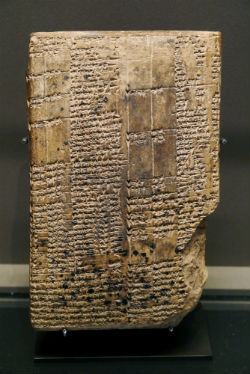

# uruk
[](https://en.wikipedia.org/wiki/File:Tablet_V_of_the_Epic_of_Gligamesh.JPG)
Uruk is the Clojure wrapper for [MarkLogic](http://www.marklogic.com/what-is-marklogic/)'s [XML Content Connector for Java (XCC/J)](https://developer.marklogic.com/products/xcc). Uruk empowers you to access your Enterprise NoSQL database from Clojure.

With Uruk, you can use MarkLogic's XCC API to:

 - evaluate stored XQuery programs
 - dynamically construct and evaluate XQuery programs
 - manage documents and stream inserts

The name Uruk comes from the [ancient Mesopotamian city-state](http://www.metmuseum.org/toah/hd/uruk/hd_uruk.htm) and [period](http://www.metmuseum.org/toah/hd/wrtg/hd_wrtg.htm) in which some of the oldest known writing has been found. One can see Uruk as perhaps the first document database—and it certainly wasn’t organized relationally.

### Maintenance Status

Uruk is used in production and is under active maintenance. This project is sponsored by [LambdaWerk](https://lambdawerk.com/home). For commercial support inquiries please get in touch at [dave.liepmann@gmail.com](mailto:dave.liepmann@gmail.com).

Uruk is part of the [XQuery-mode](https://github.com/xquery-mode/) stack for working with XQuery in emacs.


## Installation
[](https://clojars.org/uruk)

To install, add the following dependency to your *project.clj* dependencies: `[uruk "0.3.11"]`

In your namespace: `(:require [uruk.core :as uruk])`. (I also like `ur` as an alias, for brevity. Delightfully, Ur is another [ancient city-state with ties to the origins of written documents](https://en.wikipedia.org/wiki/Ur).)

To run Uruk locally, you need MarkLogic [installed on your machine](https://docs.marklogic.com/guide/installation/procedures#id_28962). To run Uruk's tests or examples, see [configuring MarkLogic for Uruk](#marklogic-configuration) below.)


## API docs

Online [API docs](https://daveliepmann.github.io/uruk/) via Codox and [autodoc](https://github.com/plexus/autodoc). Uruk documentation is also available on [cljdoc](https://cljdoc.org/d/uruk/).


## Usage

### Resources

For some background, see the [XCC Developer's Guide](https://docs.marklogic.com/guide/xcc/concepts) and the [MarkLogic XCC Javadoc](https://docs.marklogic.com/javadoc/xcc/index.html) to understand what Uruk is talking to.

For examples of how to use specific types and functions, see `test/uruk/core_test.clj`. Examples in this README are included for reference in `src/uruk/examples/readme.clj`.

### MarkLogic configuration

To run Uruk's tests or evaluate its examples directly in a REPL, you'll need to configure MarkLogic on your machine to match the settings Uruk expects. If you have an existing MarkLogic install, feel free to skip these steps and instead point your REPL at your own database.

1. Install and start a local MarkLogic server via the [Install Instructions](https://docs.marklogic.com/guide/installation/procedures#id_28962).

1. [Open the Admin Interface](https://docs.marklogic.com/guide/admin/admin_inter#id_69619) at http://localhost:8001/ 

1. [Create a forest](https://docs.marklogic.com/guide/admin/getting_started#id_13483) named "UrukForest"
 
1. [Create a database](https://docs.marklogic.com/guide/admin/databases#id_60599) named "UrukDB". Attach it to UrukForest but otherwise leave use the default settings.
  
1. [Create an XDBC Server](https://docs.marklogic.com/guide/admin/xdbc#id_21458) named "UrukServer" on port 8383.

4. Create role `uruk-tester-role` with URI privilege `view-uri`, execute-privileges `any-uri`, `xdmp:external-binary`, and `xdmp:timestamp`, and all the default document permissions (`node-update`, `execute`, `update`, `insert`, and `read`) for `xa` (these are all needed for specific tests).

5. Create user `uruk-tester` with password "password" and roles of `xa` and `uruk-tester-role`. This will be used to run tests and README examples.

6. Finally, add environment variable `URUK_TEST_IMG_PATH` (e.g. `export URUK_TEST_IMG_PATH=/path/to/uruk/resources/ml-favicon.ico`) to your Bash profile (*.bashrc*) and make sure it's available to your environment.

You should now be able to run `lein test` and, if you start up a REPL, the examples in *test/uruk/core_test.clj*.

### Examples of using Uruk
For ease of replication, the examples below are also in `src/uruk/examples/readme.clj`.

Basic usage takes the form of:
``` clojure
(with-open [session (uruk/create-session {:uri xdbc-uri :content-base database-name
                                          :user database-user :password database-pwd})]
  (uruk/execute-xquery session xquery-string))
```
...of which a concrete example is:
``` clojure
(with-open [session (uruk/create-session {:uri "xdbc://localhost:8383/"
                                          :user "uruk-tester" :password "password"})]
  (uruk/execute-xquery session "\"hello world\""))
```
...which in this case should return `("hello world")` (if you provide valid credentials).

Let's `def` our database information for brevity in the rest of our examples:
``` clojure
(def db {:uri "xdbc://localhost:8383/"
         :user "uruk-tester" :password "password"
         :content-base "UrukDB"})
```

Using that database info, let's take an overview of query functionality. Most use cases are handled by passing an optional configuration map to functions `execute-query` or `execute-module`, like so:

``` clojure
(with-open [session (uruk/create-session db)]
  (uruk/execute-xquery session
                       "xquery version \"1.0-ml\"; doc('/bigdoc.xml')"
                       {:types :raw
                        :options {:cache-result false}
                        :variables {:a "a"}
                        :shape :single}))
```
Each optional key in that configuration map is described below.

### Types
Basic type conversion is performed automatically for most [XCC types](https://docs.marklogic.com/javadoc/xcc/com/marklogic/xcc/types/package-summary.html). If for any reason you need access to the raw results, use the `:types` key in the config map, passing `:raw` like so:
``` clojure
(with-open [session (uruk/create-session db)]
  (uruk/execute-xquery session "\"hello world\"" {:types :raw}))

=> #object[com.marklogic.xcc.impl.CachedResultSequence 0x2c034c22 "CachedResultSequence: size=1, closed=false, cursor=-1"]
```

This lets you inspect result types with `result->type`:
``` clojure
(with-open [session (uruk/create-session db)]
  (uruk/result->type (uruk/execute-xquery session "\"hello world\"" {:types :raw})))

=> "xs:string"
```

Those result types are matched with `:xml-name` values in the `xcc-types` look-up table, which contains the `:ml->clj` function that Uruk uses to transform result items into more manageable Clojure types. (For most types that’s as simple as `#(.asString %)` (for XdmDocuments) or reading the number contained in a string. But if you need more in-depth handling of results, you can override the default mappings *a la carte* by passing a map to the aforementioned `types` parameter, like so:

``` clojure
(with-open [session (uruk/create-session db)]
  (uruk/execute-xquery session
                       "xquery version \"1.0-ml\"; doc('/dir/unwieldy.xml')"
                       {:types {"document-node()" #(custom-function %)})})
```
The keys for this map are used to look up `:xml-name`, and the values replace `:ml->clj`.

### Shape

For convenience, you can mold query results by specifying `:shape` in the configuration map:

| `:shape` value | Result |
| ------------- | ------------- |
| `nil` | ignore response, returning `nil` |
| `:single` | return just the first element of the response |
| `:single!` | if the response is one element, return just that element; if not (i.e. if the response is more than one element) throw an error |
| anything else | return response as-is |

For example, to clean up our simple example from earlier:
``` clojure
(with-open [session (uruk/create-session db)]
  (uruk/execute-xquery session "\"hello world\"" {:shape :single}))
=> "hello world"
```

### Options
Uruk enables you to set [Request options](https://docs.marklogic.com/javadoc/xcc/com/marklogic/xcc/RequestOptions.html) on your queries.

Request options are passed as a map to the `:options` key in the config map. All keys in that inner map must be present in `valid-request-options`. For example, to retrieve a document as a stream, use the `:cache-result` request option, which corresponds to MarkLogic's `RequestOptions.setCacheResult`. (Notice that we also specify no type conversion, because otherwise we would get the document content itself.)

``` clojure
(with-open [sess (uruk/create-session db)]
  (uruk/execute-xquery sess "xquery version \"1.0-ml\"; doc('/content-factory/new-doc')"
                       {:types :raw
                        :options {:cache-result false}}))
=> #object[com.marklogic.xcc.impl.StreamingResultSequence 0x6d7f6 "StreamingResultSequence: closed=true"]
```

### Variables
Uruk empowers you to pass XDM variables to your query, through the `:variables` key in the configuration map. Variables are most easily passed as a simple mapping from name keys to String values, like so:

``` clojure
(with-open [session (uruk/create-session db)]
  (uruk/execute-xquery session "xquery version \"1.0-ml\";
                                declare variable $my-variable as xs:string external;
                                $my-variable"
                       {:variables {"my-variable" "my-value"}
                        :shape :single!}))
```

If you need a non-XS_STRING variable, then use the more nuanced map-of-variables syntax:
``` clojure
(with-open [session (uruk/create-session db)]
  (uruk/execute-xquery session "xquery version \"1.0-ml\";
                                declare variable $my-variable as xs:integer external;
                                $my-variable"
                       {:variables {"my-variable" {:value 1
                                                   :type :xs-integer}}
                        :shape :single!}))
```
The value for `type` should be a keyword corresponding to a key in `variable-types`, e.g. `:document` for XML documents (`ValueType/DOCUMENT`). It defaults to `XS_STRING` if `:type` is not specified. For example, the first simple variables map example above could also be described as `{"my-variable" {:value "my-value"}}`.

Depending on the XdmValue type, conversion of expected Clojure values is automatic, for instance with this [*booleanNode*](https://docs.marklogic.com/javadoc/xcc/com/marklogic/xcc/types/BooleanNode.html):
``` clojure
(with-open [session (uruk/create-session db)]
  (uruk/execute-xquery session "xquery version \"1.0-ml\";
                                declare variable $my-variable as boolean-node() external;
                                $my-variable"
                       {:variables {"my-variable" {:value false
                                                   :type :boolean-node}}
                        :shape :single!}))
```

Of particular interest is that variables that are XML document-nodes or elements can be created by passing either a String representation, a hiccup-style vector, or a `clojure.data.xml.node.Element`. (Uruk uses `clojure.data.xml 0.1.0-beta2` in order to get its namespace support.)

Values are converted according to the `:clj->xdm` key in `xcc-types`. If you need to override those conversions, set the `:as-is?` key to `true` inside the map describing the variable. This puts the onus of producing the correct object on you. For instance, we could set `:as-is?` for that `booleanNode`:
``` clojure
(with-open [session (uruk/create-session db)]
  (uruk/execute-xquery session "xquery version \"1.0-ml\";
                           declare variable $my-variable as boolean-node() external;
                           $my-variable"
                       {:variables {"my-variable" {:value (-> (com.fasterxml.jackson.databind.node.JsonNodeFactory/instance)
                                                              (.booleanNode false)
                                                              ValueFactory/newBooleanNode)
                                                   :type :boolean-node
                                                   :as-is? true}}
                        :shape :single!}))
```
The variables map syntax also accepts a `:namespace` key.

### Content Sources and Session Creation
In addition to the basic `create-session` function that we've been
using thus far, Uruk also supports session creation through all the
various
[ContentSourceFactory](https://docs.marklogic.com/javadoc/xcc/com/marklogic/xcc/ContentSourceFactory.html) methods
in MarkLogic. Functions `make-uri-content-source`,
`make-hosted-content-source`, and `make-cp-content-source` are used to
create ContentSource objects that can be manipulated for more complex
session-management processes in your application. Note also that
`create-default-session` lets you create sessions by directly invoking
the default login credentials of your content sources.


### Transactions
Multiple database updates that must occur together can take advantage of transactions. To borrow an example from the XCC Developer’s Guide:

>The following example demonstrates using multi-statement transactions in Java. The first multi-statement transaction in the session inserts two documents into the database, calling Session.commit to complete the transaction and commit the updates. The second transaction demonstrates the use of Session.rollback. The third transaction demonstrates implicitly rolling back updates by closing the session.

– Programming in XCC > [Multi-Statement Transactions](https://docs.marklogic.com/guide/xcc/concepts#id_35788)

We translate the original Java to Clojure, taking advantage of Clojure’s `with-open` idiom:

``` clojure
;; Open a session and configure it to trigger multi-statement transaction use:
(with-open [session (uruk/create-session db {:auto-commit? false :update-mode true})]
  ;; The first request (query) starts a new, multi-statement transaction:
  (uruk/execute-xquery session "xdmp:document-insert('/docs/mst1.xml', <data><stuff/></data>)")

  ;; This second request executes in the same transaction as the
  ;; previous request and sees the results of the previous update:
  (uruk/execute-xquery session "xdmp:document-insert('/docs/mst2.xml', fn:doc(\"/docs/mst1.xml\"));")

  ;; After commit, updates are visible to other transactions. Commit
  ;; ends the transaction after current statement completes.
  (uruk/commit session) ;; <—- Transaction ends; updates are kept

  ;; Rollback discards changes and ends the transaction. The following
  ;; document deletion query never occurs, since it is rolled back
  ;; before calling commit:
  (uruk/execute-xquery session "xdmp:document-delete('/docs/mst1.xml')")
  (uruk/rollback session) ;; <– Transaction ends; updates are lost

  ;; Closing session without calling commit causes a rollback. The
  ;; following update is lost, since we don't commit before the end of
  ;; the (with-open) and its implicit `.close`:
  (uruk/execute-xquery session "xdmp:document-delete('/docs/mst1.xml')"))
```

### Inserting Clojure XML Elements

You can insert `clojure.data.xml.node.Element` objects as content:

``` clojure
(with-open [session (uruk/create-session db)]
  (uruk/insert-element session
                       "/content-factory/new-doc" ;; uri to insert at
                       (clojure.data.xml/element :foo)))
```
This function takes an optional map describing document metadata, including Content Creation Options to use during the insert. For example:

``` clojure
(with-open [session (uruk/create-session db)]
  (uruk/insert-element session
                       "/content-factory/another-new-doc"
                       (clojure.data.xml/element :bar)
                       {:quality 2}))
```
See `uruk.core/valid-content-creation-options`, which is a Clojurey version of the possibilities described by [ContentCreateOptions](https://docs.marklogic.com/javadoc/xcc/com/marklogic/xcc/ContentCreateOptions.html).

### Inserting Text

You can also directly insert text as content, in any of MarkLogic's supported forms (text, binary, JSON, XML):

``` clojure
(with-open [session (uruk/create-session db)]
  (uruk/insert-string session
                      "/content-factory/new-text-doc" ;; uri to insert at
                      "<abc>def</abc>"))
```
The `insert-string` function used here automatically detects string type and inserts the correct type of content. For instance, in this example, the string will be automatically inserted as XML, since `clojure.data.xml/parse-str` successfully parses it as XML. This function takes options just like `insert-element`.


<p align="center"><a href="https://commons.wikimedia.org/wiki/File:Dictionary_-_Louvre,_Near_Eastern_Antiquities_in_the_Louvre,_Room_3,_Case_15_-_AO_7661.jpg"></a></p>


## Uncovered surface area
Uruk is sturdy and ready for production. However, some aspects of the XCC/J API have not yet been implemented:

  - [JNDI](https://docs.marklogic.com/javadoc/xcc/com/marklogic/xcc/jndi/package-summary.html)
  - [XCC Service Provider Interface](https://docs.marklogic.com/javadoc/xcc/com/marklogic/xcc/spi/package-summary.html) -- note the MarkLogic disclaimer that this is for advanced users only, not endorsed for independent use, and "use at your own risk"
  - [ResultChannelName](https://docs.marklogic.com/javadoc/xcc/com/marklogic/xcc/ResultChannelName.html)


## TODO
  - update clojure.data.xml preview dependency--see https://github.com/clojure/data.xml/blob/master/CHANGES.md
  - look into possibly using clojure.spec (once Clojure 1.9 is stable)
  - (breaking change) consider namespaced keys for various config options
  - generative testing (for instance, in `as-expected-session-config?`)
  - ensure `insert-element` robustly covers needed use cases
  - possibly implement REx to automatically parse XQuery for XDM variable types
  - possibly implement `use-fixtures` within tests to create user with appropriate permissions

## License

Copyright © 2016-2018 David Liepmann

Distributed under the Eclipse Public License either version 1.0 or (at
your option) any later version.
